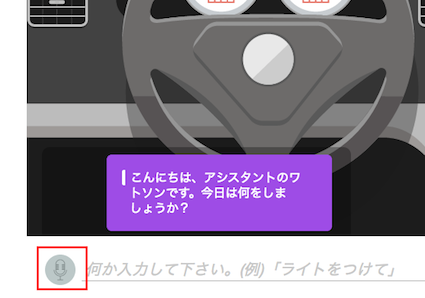
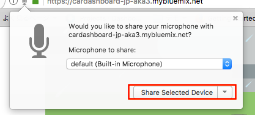

# Conversation サンプルアプリケーション

デモ画面  
  
  
  
このアプリケーションはWaston Developers Cloud上で公開されている[サンプルアプリ car dashboard][car-dashboad]を日本語対応(※)した上で音楽演奏機能を追加したものです。  
Watson APIのうち主にConversationの機能を確認するためのアプリケーションとなっています。  
また、オプションで Speech to Text, Text to Speechを組み合わせて使うことも可能です。  
なお、サンプルの音楽はすべて著作権フリーのものを利用しています。  
音楽データ差替えの方法は、当READMEの最後に記載しました。  

このデモでアプリは、次のような会話が可能です。  
 
### 機器の操作 (「ライトをつけて」など)
ライト、ワイパー、クーラー、ヒーターの ON / OFF
### 音楽の演奏 (「音楽を演奏して」など)  
曲のジャンル: ロック、クラシック、ジャズ、ポップス、演歌
### レストランの案内 (「おなかがすいた」など)
レストランの種類: 和食、中華、イタリアン  

(※) 日本語化するにあたっては、インテント、インテントの例文、フローなど一部簡略化を行っている点をご理解下さい。

# 導入手順

## Bluemixアカウントの準備

[Bluemixアカウントを作る][sign_up] か、あるいは既存のBluemixアカウントを利用します。

## ibmcloudコマンドの導入
導入にはibmcloudコマンドを利用します。  
ibmcloudコマンドが未導入の場合は、以下のリンク先からダウンロード・導入を行って下さい。  
[IBM Cloudコマンドラインツール](https://console.bluemix.net/docs/cli/reference/ibmcloud/download_cli.html#install_use)  
注意: ibmcloudコマンドのバージョンは最新として下さい。 

## ソースのダウンロード
Githubからアプリケーションのソースをダウンロードします。  
カレントディレクトリのサブディレクトリにソースはダウンロードされるので、あらかじめ適当なサブディレクトリを作り、そこにcdしてから下記のコマンドを実行します。  
GITコマンドを使わない場合は、[Github](https://github.com/makaishi2/car-dashboard-jp) にブラウザからアクセスして、zipファイルをダウンロード後、解凍します。  
ダウンロード後、できたサブディレクトリにcdします。  
以下はgitコマンドを使う場合の例です。
 

```
$ cd (適当なサブディレクトリ)
$ git clone https://github.com/makaishi2/car-dashboard-jp.git
$ cd car-dashboard-jp
```

## ibmcloudコマンドでログイン
IBM Cloud環境にログインします。  
ログイン名、パスワードはIBM Cloudアカウント登録で登録したものを利用します。  
ログイン後には、``ibmcloud target --cf``コマンドを実行し、ターゲットの組織とスペースを確定して下さい。

```
$ ibmcloud login
$ ibmcloud target --cf
```

## Conversationサービスの作成
以下のコマンドでConversationサービスを作成します。

```
$ ibmcloud service create conversation lite conv-car-1
```


## ワークスペースの取込み
以下の手順で先ほど作ったConversationのインスタンスにワークスペースを取込みます。

- 左上のメニューから「ダッシュボード」を選択し、Bluemix Dashboardを表示させます。

- ダッシュボード上のサービス一覧から先ほど作成した "conv-car-1" を選択します。

- 画面右上の「Launch tool」をクリック

&nbsp;&nbsp;&nbsp;&nbsp;&nbsp;&nbsp;&nbsp;&nbsp;&nbsp;&nbsp;&nbsp;&nbsp;

- 下記の画面が出たら「Log In with IBM ID」

&nbsp;&nbsp;&nbsp;&nbsp;&nbsp;&nbsp;&nbsp;&nbsp;&nbsp;&nbsp;&nbsp;&nbsp;

- 下の画面で赤枠で示された「import worksace」のアイコンをクリック

&nbsp;&nbsp;&nbsp;&nbsp;&nbsp;&nbsp;&nbsp;&nbsp;&nbsp;&nbsp;&nbsp;&nbsp;

- 下の画面で事前にダウンロード済みのソースツリー配下「trainings/car-workspace-jp.json」を指定し、「import」ボタンをクリック

&nbsp;&nbsp;&nbsp;&nbsp;&nbsp;&nbsp;&nbsp;&nbsp;&nbsp;&nbsp;&nbsp;&nbsp;

- インポートに成功し、下記の画面が現れたら、下図赤枠で囲まれたアイコンをクリックし、ワークスペース一覧表示の画面に戻ります。

&nbsp;&nbsp;&nbsp;&nbsp;&nbsp;&nbsp;&nbsp;&nbsp;&nbsp;&nbsp;&nbsp;&nbsp;

## ワークスペースIDの取得

- ワークスペース一覧画面で、新たに作られた"Car\_Dashboard\_Current"のメニューアイコンをクリックし、更に「Veiw details」のメニューを選ぶと、WORKSPACE\_IDが表示されるので、テキストエディタなどに値をコピーします。

&nbsp;&nbsp;&nbsp;&nbsp;&nbsp;&nbsp;&nbsp;&nbsp;&nbsp;&nbsp;&nbsp;&nbsp;

## アプリケーションのデプロイ

次のコマンドを実行します。  
\<app_name\>はなんでもいいのですが、インターネット上のURLの一部となるので、ユニークな名前を指定します。  
(例) car-dashboard-aka3

```
$ ibmcloud app push <app_name>
```

## 環境変数の設定

デブロイが正常に終了したら、次のコマンドで環境変数の設定を行います。

```
$ ibmcloud app env-set <app_name> WORKSPACE_ID <workspace_id>
$ ibmcloud app restage <app_name>
```

## アプリケーションのURLと起動

再構成が完了したらアプリケーションを起動できます。次のURLをブラウザから指定して下さい。  

```
https://<app_name>.mybluemix.net/
```


## STT/TTSサービスを利用する場合(オプション)

オプションのSTT/TTSサービスを利用する場合は追加で以下の手順を実行して下さい。

### STT/TTSサービスの作成・バインド・再構成
以下のコマンドでSTT/TTSサービスを追加・バインド・再構成します。

```
$ ibmcloud service create speach_to_text lite stt-car-1
$ ibmcloud service create text_to_speech lite tts-car-1
$ ibmcloud service bind <app_name> stt-car-1
$ ibmcloud service bind <app_name> tts-car-1
$ ibmcloud app restage <app_name>
```

### ブラウザ上の操作  
音声入力機能を利用したい場合、ブラウザはFirefoxを利用するようにして下さい。  
画面左下のマイクアイコンをクリックすると、次の画面のようなマイク利用許可のパネルが出て聞きます。  



利用したいマイクを選んで共有ボタンを押すと、マイク入力が開始されます。

  

(注)　音声認識の性能は、マイクの性能にも依存します。できる限りパソコン内蔵のマイクでなく、専用マイクを利用されることをお勧めします。

## (参考) アプリケーションの修正
Bluemixで稼働しているNode.jsアプリケーションのソースは git cloneコマンドでダウンロードしたローカルファイルです。このソースを修正して、再度 "cf push \<service_name\>"コマンドを実行すると、Bluemix上のアプリケーションにも修正が反映されます。  
自分でアプリケーションコードを開発したい場合は、このサンプルソースを雛形に試してみると、効率よくアプリケーション開発ができます。

## ローカルで起動する場合

アプリケーションを修正する時は、ローカルでもテストできる方が便利です。そのための手順は以下の通りです。

* Node.jsの導入  
ローカルにNode.jsを導入する必要があります。
[Node.jsダウンロード][node_js]からダウンロードして下さい。
* 認証情報の確認  
BluemixダッシュボードからConversationサービスの管理画面を開き、username, passwordの値を調べてテキストエディタなどにコピーします。
* local.envファイルの設定
次のコマンドでlocal.envファイルの雛形からlocal.envをコピーし、エディタで調べたusername, passwordを設定します。

```
$ cp local.env.sample local.env
```

```
CONVERSATION_USERNAME=xxxxxxxx-xxxx-xxxx-xxxx-xxxxxxxxxxxx
CONVERSATION_PASSWORD=xxxxxxxxxxxx
```
* Node.jsアプリケーションの導入、実行
以下のコマンドでアプリケーションの導入、実行を行います。

```
$ npm install
$ npm start
```

## (参考)音楽データ差替え方法

簡単にできるアプリケーション修正の例として音楽データの差替えがあります。以下で簡単にその方法について説明します。  
音楽データはソースツリーの中で ui/audio配下にあります。    
ファイル名からどのジャンルの音楽かわかりますので、変更したい音楽ファイルを差し替えた上で、"cf push"コマンドを実行すれば差替えが可能です。  
音声認識と組み合わせて利用する場合は、ナレーションとの関係で頭に5秒程度無音とすることが望ましいです。  

新しいジャンルの音楽を増やしたい場合は、

1. Conversation編集画面からエンティティ「genre」に該当ジャンルを追加し
2. ソースツリーでは ui/ibm/music-player.jsファイルを編集
3. ソースツリー上 ui/audio/配下に該当音楽ファイルを追加
4. "cf push"コマンドでBluemix上にデプロイ

を行います。


### (参考) Bluemixとローカル両方で動くアプリの作り方
qittaに別記事 [Bluemix上のWatsonアプリをローカル環境で開発・デバッグする際のTips](https://qiita.com/makaishi2/items/06dd45ae50891d66aef5) をあげておきましたので、関心ある方はこちらも参考にされて下さい。

[node_js]: https://nodejs.org/ja/download/
[car-dashboad]: https://github.com/watson-developer-cloud/car-dashboard
[node_js]: https://nodejs.org/#download
[cloud_foundry]: https://github.com/cloudfoundry/cli#downloads
[git]: https://git-scm.com/downloads
[npm_link]: https://www.npmjs.com/
[sign_up]: https://bluemix.net/registration
[bluemix_dashboard]: https://console.bluemix.net/dashboard/
[local_url]: http://localhost:3000
