# Conversation サンプルアプリケーション

デモ画面  
  
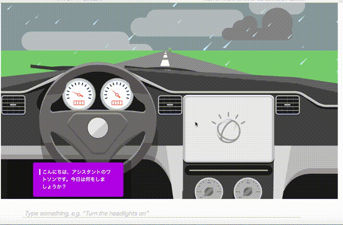  
  
このアプリケーションはWaston Developers Cloud上で公開されている[サンプルアプリ car dashboard][car-dashboad]を日本語対応(※)した上で音楽演奏機能を追加したものです。  
Watson APIのうち、Conversation, Speech to Text, Text to Speechを使っており、この3つのAPIの機能を確認できるアプリケーションとなっています。  
音声認識も利用する場合は、ブラウザにFirefoxを使うようにして下さい。  
なお、サンプルの音楽はすべて著作権フリーのものを利用しています。  
音楽データ差替えの方法は、当READMEの最後に記載しました。  

このデモでアプリは、次のような会話が可能です。  
 
### 機器の操作 (「ライトをつけて」など)
ライト、ワイパー、クーラー、ヒーターの ON / OFF
### 音楽の演奏 (「音楽を演奏して」など)  
曲のジャンル: ロック、クラシック、ジャズ、ポップス、演歌
### レストランの案内 (「おなかがすいた」など)
レストランの種類: 和食、中華、イタリアン  

(※) 日本語化するにあたっては、インテント、インテントの例文、フローなど一部簡略化を行っている点をご理解下さい。

# Bluemix環境への自動導入
最も簡単にBluemix上にデモ環境を作りたい場合は、「自動導入」をお勧めします。  
その場合、以下の手順に従って下さい。 

## 事前準備
Bluemixアカウントを持っていない場合は [Bluemixアカウントを作る][sign_up] に従い、Bluemixアカウントを作成します。  
Bluemixアカウントを使って、 [Bluemixダッシュボード][bluemix_dashboard] を表示させて下さい。

## サービス・インスタンスの自動生成
  
- 次のボタンを押して下さい。

&nbsp;&nbsp;&nbsp;&nbsp;&nbsp;&nbsp;&nbsp;&nbsp;&nbsp;&nbsp;&nbsp;&nbsp; [](https://bluemix.net/deploy?repository=https://git.ng.bluemix.net/akaishi/car-dashboard-jp)


- 下の画面が表示されたら「アプリ名」をわかりやすいものに変更し(アプリケーションのURLの一部になります) 、「デプロイ」ボタンをおします。


&nbsp;&nbsp;&nbsp;&nbsp;&nbsp;&nbsp;&nbsp;&nbsp;&nbsp;&nbsp;&nbsp;&nbsp;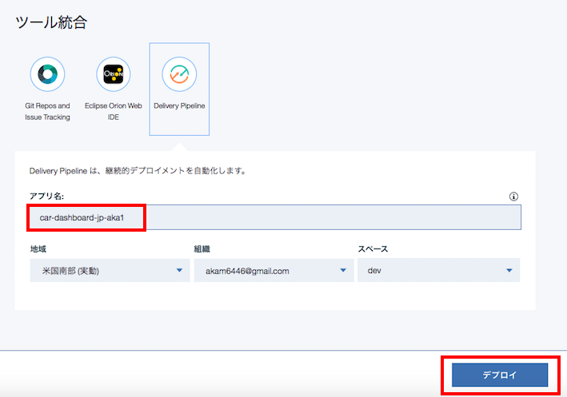


* このボタンを押すことにより次の処理が自動的に行われます。
  - CloudFoundaryアプリケーションの作成
  - Watson APIの１つであるConversationサービスインスタンスの作成
  - Watson APIサービスの "Speech To Text"と"Text To Speech"インスタンスの作成

- 次の画面が表示されたら一番右の「Delivery Pipeline」を選択します。

&nbsp;&nbsp;&nbsp;&nbsp;&nbsp;&nbsp;&nbsp;&nbsp;&nbsp;&nbsp;&nbsp;&nbsp;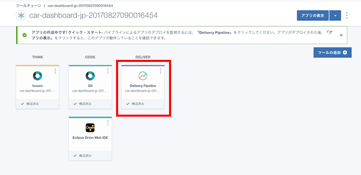

- 最初のビルドは、下の画面のように失敗しますが、この段階では気にしないで下さい。

&nbsp;&nbsp;&nbsp;&nbsp;&nbsp;&nbsp;&nbsp;&nbsp;&nbsp;&nbsp;&nbsp;&nbsp;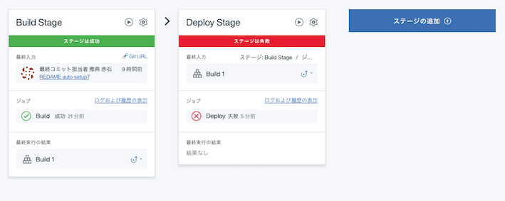

## ワークスペースの取込み
- 左上のメニューから「ダッシュボード」を選択し、Bluemix Dashboardを表示させます。

&nbsp;&nbsp;&nbsp;&nbsp;&nbsp;&nbsp;&nbsp;&nbsp;&nbsp;&nbsp;&nbsp;&nbsp;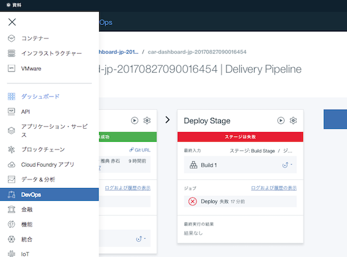

- ダッシュボード上のサービス一覧から先ほど自動作成した "my-conversation-service" を選択します。

&nbsp;&nbsp;&nbsp;&nbsp;&nbsp;&nbsp;&nbsp;&nbsp;&nbsp;&nbsp;&nbsp;&nbsp;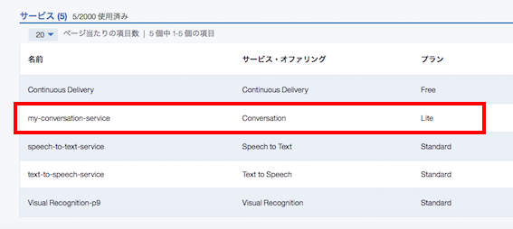

- 画面右上の「Launch tool」をクリック

&nbsp;&nbsp;&nbsp;&nbsp;&nbsp;&nbsp;&nbsp;&nbsp;&nbsp;&nbsp;&nbsp;&nbsp;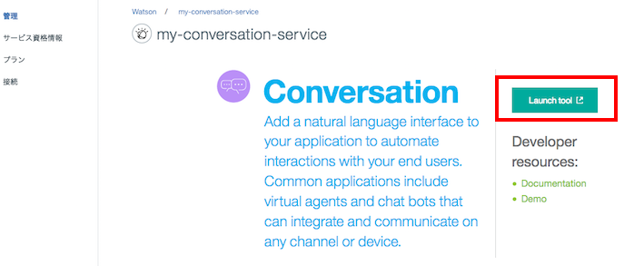

- 下記の画面が出たら「Log In with IBM ID」

&nbsp;&nbsp;&nbsp;&nbsp;&nbsp;&nbsp;&nbsp;&nbsp;&nbsp;&nbsp;&nbsp;&nbsp;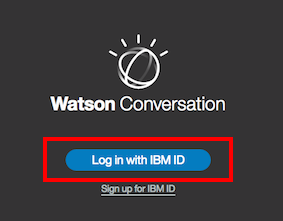

- 下の画面で赤枠で示された「import worksace」のアイコンをクリック

&nbsp;&nbsp;&nbsp;&nbsp;&nbsp;&nbsp;&nbsp;&nbsp;&nbsp;&nbsp;&nbsp;&nbsp;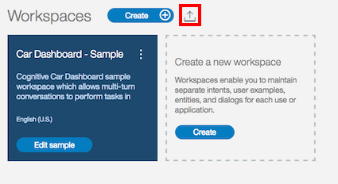

- 下の画面でソースツリー配下の「trainings/car-dashbord-jp.json」を指定し、「import」ボタンをクリック

&nbsp;&nbsp;&nbsp;&nbsp;&nbsp;&nbsp;&nbsp;&nbsp;&nbsp;&nbsp;&nbsp;&nbsp;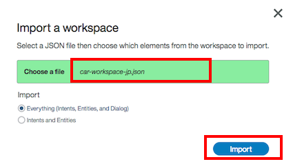

- インポートに成功し、下記の画面が現れたら、下図赤枠で囲まれたアイコンをクリックし、ワークスペース一覧表示の画面に戻ります。

&nbsp;&nbsp;&nbsp;&nbsp;&nbsp;&nbsp;&nbsp;&nbsp;&nbsp;&nbsp;&nbsp;&nbsp;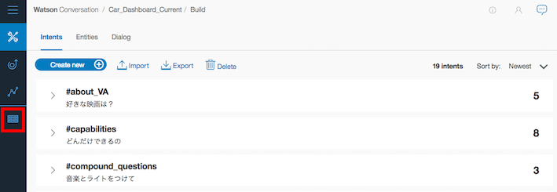

## ワークスペースIDの取得

- ワークスペース一覧画面で、新たに作られた"Car\_Dashboard\_Current"のメニューアイコンをクリックし、更に「Veiw details」のメニューを選ぶと、CONVERSATION\_IDが表示されるので、テキストエディタなどのコピーします。

&nbsp;&nbsp;&nbsp;&nbsp;&nbsp;&nbsp;&nbsp;&nbsp;&nbsp;&nbsp;&nbsp;&nbsp;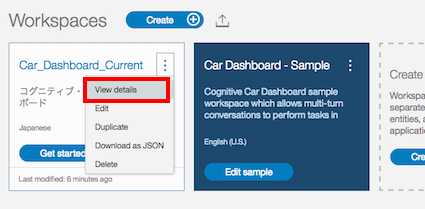

## 環境変数の設定

- Bluemixダッシュボードの画面に戻ったら、Cloud Foundaryアプリの一覧の中からcar_dashboardのアプリを選択します。

&nbsp;&nbsp;&nbsp;&nbsp;&nbsp;&nbsp;&nbsp;&nbsp;&nbsp;&nbsp;&nbsp;&nbsp;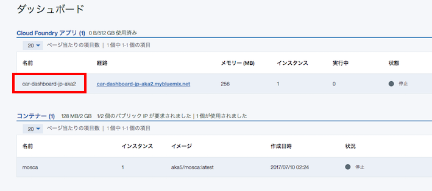

- Cloud Foundryアプリ管理画面から「ランタイム」「環境変数」をクリックします。

&nbsp;&nbsp;&nbsp;&nbsp;&nbsp;&nbsp;&nbsp;&nbsp;&nbsp;&nbsp;&nbsp;&nbsp;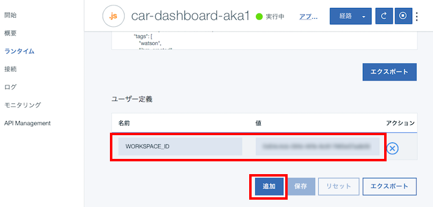

- 画面を下にスクロールし「追加」ボタンをクリックします。「名前」にはWORDSPACE\_IDを、「値」には先ほどコピーしたWORDSPACE\_IDの値を入力し、「保存」ボタンをクリックします。

&nbsp;&nbsp;&nbsp;&nbsp;&nbsp;&nbsp;&nbsp;&nbsp;&nbsp;&nbsp;&nbsp;&nbsp;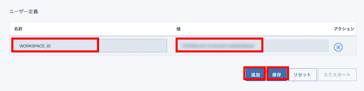

## アプリケーション起動

- 再びBliemixダッシュボードの画面に戻ります。赤枠で囲まれたリンクがアプリケーションへのリンクなので、こちらをクリックします。

&nbsp;&nbsp;&nbsp;&nbsp;&nbsp;&nbsp;&nbsp;&nbsp;&nbsp;&nbsp;&nbsp;&nbsp;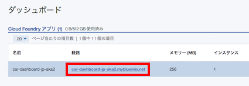

# Bluemixへの手動導入(以下工事中)
より細かくBluemixの挙動を知りたい場合は、以下の「手動導入」の手順をお勧めします。  
「手動導入」には導入先により「ローカルへの導入」と「Bluemixへの導入」があります。  
「事前準備」はどちらの導入先を選ぶ場合も共通に必要な手順です。  

## 事前準備

### Bluemixアカウントの準備
[Bluemixアカウントを作る][sign_up] か、あるいは既存のBluemixアカウントを利用します。

### 前提ソフトの導入
次の前提ソフトを導入します。Node.jsはローカルで動かす場合に必要となります。  
 - [gitコマンドラインツール][git]  
 - [Cloud Foundryコマンドラインツール][cloud_foundry]  
 - [Node.js][node_js]  
  
  注意: Cloud Foundaryのバージョンは最新として下さい。

## サービスの作成
デモで利用する、Conversation, Speech to Text, Text to Speechの3つのWatsonサービスを作成します。  
Conversationサービスの作成手順は以下の通りです。  

Bluemixダッシュボードから「カタログ」「Watson」「Conversation」を順に選択  

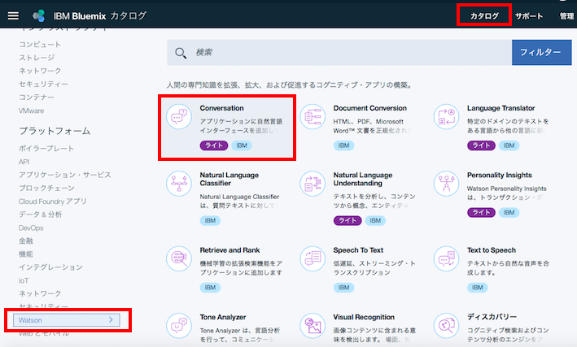  
 　   
下記の画面が表示されたら、すべてデフォルト値のまま「作成」を選択  
  
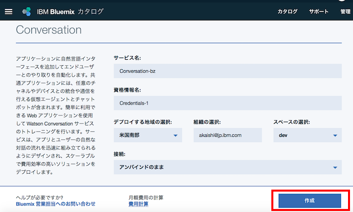  
  
Speech to Text、Text to Speechに関しても同様のことを繰り返します。 

## ソースのダウンロード
カレントディレクトリのサブディレクトリにソースはダウンロードされるので、あらかじめ適当なサブディレクトリを作り、そこにcdしておきます。

```
git clone https://git.ng.bluemix.net/akaishi/car-dashboard-jp.git
```


## サンプルワークスペースの作成
ダッシュボードの画面から先ほど作成したConversationサービスを選択し、次の画面を表示して、「Launch tool」のボタンをクリックします。 
  
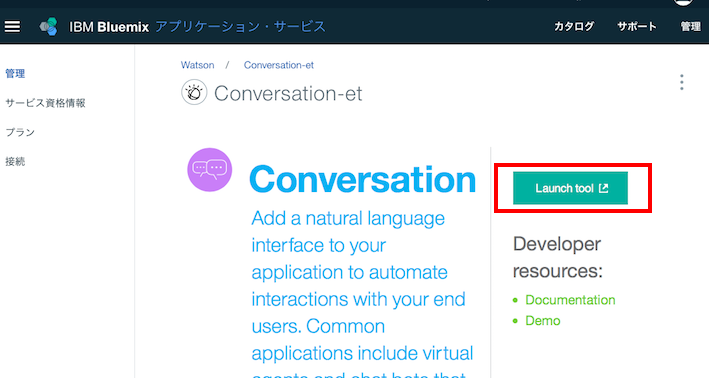  
  
下にある「Import Workspace」のアイコンをクリックします。  
  
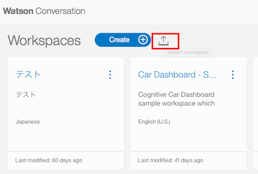  
  
下の画面が表示されたら、まず「Choose a file」で先ほどダウンロードしたソース配下の training/car-dachboard-jp.jsonを選択し、「Import」ボタンをクリックします。  
  
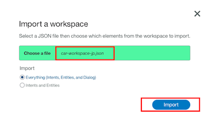  

## 環境変数の確認
デモを動かすのに必要な以下の環境変数の値を調べ、テキストエディタなどにコピーします。  
(ローカル環境で動作確認をしない場合は、WORKSPACE_ID以外の確認は不要です)  

```
WORKSPACE_ID
CONVERSATION_USERNAME
CONVERSATION_PASSWORD
TEXT_TO_SPEECH_USERNAME
TEXT_TO_SPEECH_PASSWORD
SPEECH_TO_TEXT_USERNAME
SPEECH_TO_TEXT_PASSWORD
```
  
WORDSPACE\_IDは、Conversaionサービス管理画面から「Launch Tool」ワークスペースごとの詳細メニューから「View Deatails」を選択して確認します。  
  
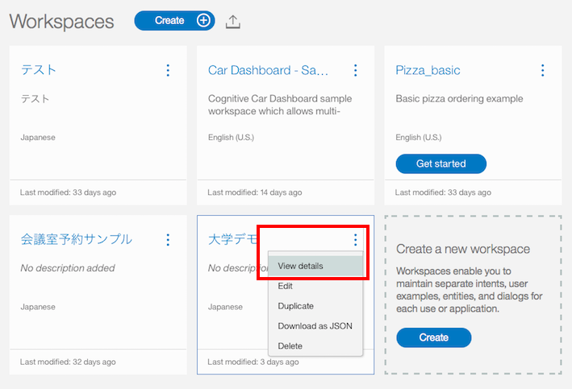  
  
CONVERSATION\_USERNAMEとCONVERSATION\_PASSWORDは、Conversationサービス管理画面から「資格情報」「資格情報の表示」を選択  

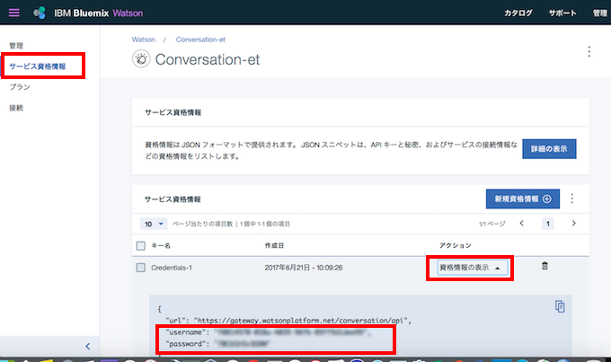  
  
TEXT\_TO\_SPEECH\_USERNAME、TEXT\_TO\_SPEECH\_PASSWORD、
SPEECH\_TO\_TEXT\_USERNAME、SPEECH\_TO\_TEXT\_PASSWORDも同様のやり方で調べます。  
  
  
## ローカル環境への導入
### プログラムの導入

次のコマンドを実行して必要なモジュールを導入します。  
  
```
cd car-dashboard-jp
npm install
npm run build
```

### 環境変数の設定

カレントディレクトリにあるlocal.env.sampleをlocal.envにコピーします。  
  
```
cp local.env.sample local.env
```

local.envをテキストエディタで開いて、下記の項目にそれぞれの値を設定して下さい。

```
WORKSPACE_ID=xxxxxxxx-xxxx-xxxx-xxxx-xxxxxxxxxxxx
CONVERSATION_USERNAME=xxxxxxxx-xxxx-xxxx-xxxx-xxxxxxxxxxxx
CONVERSATION_PASSWORD=xxxxxxxxxxxx
SPEECH_TO_TEXT_PASSWORD=xxxxxxxxxxxx
SPEECH_TO_TEXT_USERNAME=xxxxxxxx-xxxx-xxxx-xxxx-xxxxxxxxxxxx
TEXT_TO_SPEECH_USERNAME=xxxxxxxx-xxxx-xxxx-xxxx-xxxxxxxxxxxx
TEXT_TO_SPEECH_PASSWORD=xxxxxxxxxxxx
```
        
設定が完了したら、次のコマンドでnode.jsを起動します。
```
npm start
```
  
正常にNode.jsが起動できていれば、ブラウザから [http://localhost:3000][local_url] のURLでアプリケーションを起動できます。

#Bluemix環境への導入
##プログラムの配布
cf loginコマンドではemailとpasswordを聞かれるのでbluemix登録時のemailアドレスとパスワードを指定します。  
cf pushコマンドで指定する \<your\_appl\_name\> はBluemix上のインスタンス名であると同時に、インターネット上のURL名にもなるので、ユニークなものを指定します。  

```
cd car-dashboard-jp
cf login
cf push <your_appl_name>
```

##サービスのバインド
前の手順でローカル環境でNode.jsを動かしている場合、cf pushコマンドでlocal.envファイルのコピーも行われるので、以下の手順は必要ありません。  
この手順はローカルでのテストを省いてBluemix上で動かす場合、または継続的開発環境の設定をBluemix上で行いGithub上のソースをBluemix環境に直接デプロイする場合に必要となります。  
Cloud Foundaryアプリのリストの中から先ほど作成したCar Dashboardのアプリケーションを選択し、下の管理画面を表示させます。  
画面から「接続」「既存に接続」を選択し、Discovery、Speech to Text、Text to Speechの3つのサービスを順に選択します。  

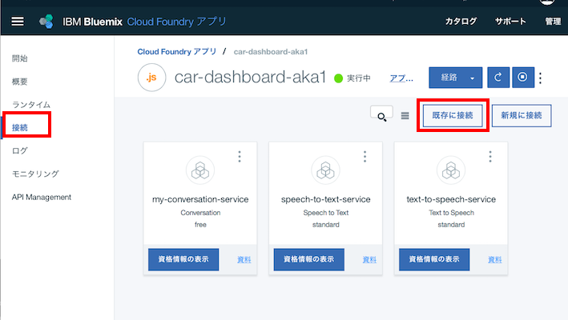  
  
設定のたびに「アプリの再ステージ」の質問が出ますが、すべて「キャンセル」を選択します。  

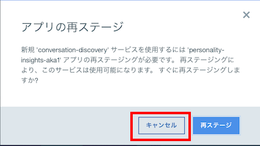  
  

# <a name="set_env"></a> 環境変数のセット
WORKSPACE_IDに関しては、CloudFoundary管理画面から、「ランタイム」「環境変数」を選択して設定します。  

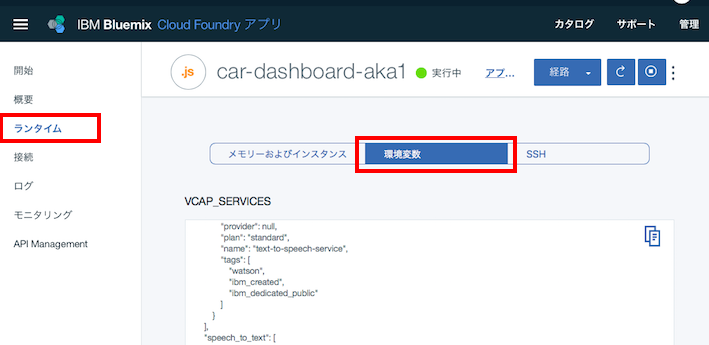
  
右のペインを下にスクロールして「追加」ボタンをクリックし、WORKSPACE_IDとその値を設定して、「保存」をクリックします。  

  

# <a name="start_app"></a> アプリケーションのURLと起動

環境変数を保存すると自動的に再構成が動き出します。　　
しばらくしてこれが完了したら、下記の画面で該当するCloud Foundaryアプリケーションの「経路」のリンクをクリックするとアプリケーションが起動されます。　　
  
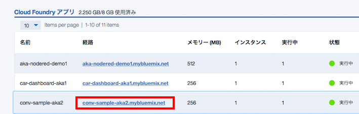  


## 音楽データ差替え方法
(TBD)
  
[car-dashboad]: https://github.com/watson-developer-cloud/car-dashboard
[node_js]: https://nodejs.org/#download
[cloud_foundry]: https://github.com/cloudfoundry/cli#downloads
[git]: https://git-scm.com/downloads
[npm_link]: https://www.npmjs.com/
[sign_up]: https://bluemix.net/registration
[bluemix_dashboard]: https://console.bluemix.net/dashboard/
[local_url]: http://localhost:3000
