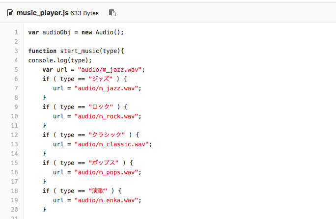

# Conversation サンプルアプリケーション

デモ画面  
  
  
  
このアプリケーションはWaston Developers Cloud上で公開されている[サンプルアプリ car dashboard][car-dashboad]を日本語対応(※)した上で音楽演奏機能を追加したものです。  
Watson APIのうち、Conversation, Speech to Text, Text to Speechを使っており、この3つのAPIの機能を確認できるアプリケーションとなっています。  
音声認識も利用する場合は、ブラウザにFirefoxを使うようにして下さい。  
なお、サンプルの音楽はすべて著作権フリーのものを利用しています。  
音楽データ差替えの方法は、当READMEの最後に記載しました。  

このデモでアプリは、次のような会話が可能です。  
 
### 機器の操作 (「ライトをつけて」など)
ライト、ワイパー、クーラー、ヒーターの ON / OFF
### 音楽の演奏 (「音楽を演奏して」など)  
曲のジャンル: ロック、クラシック、ジャズ、ポップス、演歌
### レストランの案内 (「おなかがすいた」など)
レストランの種類: 和食、中華、イタリアン  

(※) 日本語化するにあたっては、インテント、インテントの例文、フローなど一部簡略化を行っている点をご理解下さい。

# 導入手順

## Bluemixアカウントの準備

[Bluemixアカウントを作る][sign_up] か、あるいは既存のBluemixアカウントを利用します。

## 前提ソフトの導入
次の前提ソフトを導入します。下記のリンク先からダウンロード後、それぞれ導入して下さい。

[gitコマンドラインツール][git]  
[Cloud Foundryコマンドラインツール][cloud_foundry]  
  
注意: Cloud Foundaryのバージョンは最新として下さい。 

## ソースのダウンロード
Githubからアプリケーションのソースをダウンロードします。  
カレントディレクトリのサブディレクトリにソースはダウンロードされるので、あらかじめ適当なサブディレクトリを作り、そこにcdしてから下記のコマンドを実行します。  
ダウンロード後、できたサブディレクトリにcdします。
 

```
$ cd (適当なサブディレクトリ)
$ git clone https://git.ng.bluemix.net/akaishi/car-dashboard-jp.git
$ cd car-dashboard-jp
```

## CFコマンドでログイン
CFコマンドでbluemix環境にログインします。ログイン名、パスワードはBluemixアカウント登録で登録したものを利用します。  
ログインに成功すると、次のような画面となります。  

```
$ cf login
```

  

## Conversationサービスの作成
以下のコマンドでConversationサービスを作成します。

```
$ cf create-service conversation free conv-car-1
$ cf create-service-key conv-car-1 myKey
```


## STT/TTSサービスの作成(オプション)
音声機能も追加したい場合は、以下のコマンドでSTT/TTSサービスも追加します。

```
$ cf create-service speech_to_text standard stt-car-1
$ cf create-service-key stt-car-1 myKey
$ cf create-service text_to_speech standard tts-car-1
$ cf create-service-key tts-car-1 myKey
```

## ワークスペースの取込み
以下の手順で先ほど作ったConversationのインスタンスにワークスペースを取込みます。
- 左上のメニューから「ダッシュボード」を選択し、Bluemix Dashboardを表示させます。

&nbsp;&nbsp;&nbsp;&nbsp;&nbsp;&nbsp;&nbsp;&nbsp;&nbsp;&nbsp;&nbsp;&nbsp;

- ダッシュボード上のサービス一覧から先ほど自動作成した "my-conversation-service" を選択します。

&nbsp;&nbsp;&nbsp;&nbsp;&nbsp;&nbsp;&nbsp;&nbsp;&nbsp;&nbsp;&nbsp;&nbsp;

- 画面右上の「Launch tool」をクリック

&nbsp;&nbsp;&nbsp;&nbsp;&nbsp;&nbsp;&nbsp;&nbsp;&nbsp;&nbsp;&nbsp;&nbsp;

- 下記の画面が出たら「Log In with IBM ID」

&nbsp;&nbsp;&nbsp;&nbsp;&nbsp;&nbsp;&nbsp;&nbsp;&nbsp;&nbsp;&nbsp;&nbsp;

- 下の画面で赤枠で示された「import worksace」のアイコンをクリック

&nbsp;&nbsp;&nbsp;&nbsp;&nbsp;&nbsp;&nbsp;&nbsp;&nbsp;&nbsp;&nbsp;&nbsp;

- 下の画面で事前にダウンロード済みのソースツリー配下「trainings/car-dashbord-jp.json」を指定し、「import」ボタンをクリック

&nbsp;&nbsp;&nbsp;&nbsp;&nbsp;&nbsp;&nbsp;&nbsp;&nbsp;&nbsp;&nbsp;&nbsp;

- インポートに成功し、下記の画面が現れたら、下図赤枠で囲まれたアイコンをクリックし、ワークスペース一覧表示の画面に戻ります。

&nbsp;&nbsp;&nbsp;&nbsp;&nbsp;&nbsp;&nbsp;&nbsp;&nbsp;&nbsp;&nbsp;&nbsp;

## ワークスペースIDの取得

- ワークスペース一覧画面で、新たに作られた"Car\_Dashboard\_Current"のメニューアイコンをクリックし、更に「Veiw details」のメニューを選ぶと、WORKSPACE\_IDが表示されるので、テキストエディタなどのコピーします。

&nbsp;&nbsp;&nbsp;&nbsp;&nbsp;&nbsp;&nbsp;&nbsp;&nbsp;&nbsp;&nbsp;&nbsp;

## アプリケーションのデプロイ

次のコマンドを実行します。
\<service_name\>はなんでもいいのですが、インターネット上のURLの一部となるので、ユニークな名前を指定します。  
(例) car-dashboard-aka3

```
$ cf push <service_name>
```

## 環境変数の設定

デブロイが正常に終了したら、次のコマンドで環境変数の設定を行います。

```
$ cf set-env <service_name> WORKSPACE_ID <workspace_id>
$ cf restage <service_name>
```

## アプリケーションのURLと起動

再構成が完了したらアプリケーションを起動できます。次のURLをブラウザから指定して下さい。
マイク入力を使いたい場合、ブラウザはFirefoxにする必要があります。

```
https://<service_name>.mybluemix.net/
```


## 音楽データ差替え方法

Bluemixのアプリケーション管理画面から、下図の「ツールチェーンの表示」ボタンをクリックします。


ツールチェーンの画面から「Git」をクリックします。


Gitのソースコードリポジトリ画面が表示されたら、"ui/audio"のサブディレクトリを表示します。


差替えを行いたい音楽ファイルを選択します。図の「Replace」ボタンをクリックして差替え音楽ファイルを指定します。


新しいジャンルの音楽を増やしたい場合は、

1. Conversation編集画面からエンティティ「genre」に該当ジャンルを追加し
2. GitHub上のソースツリーでは ui/ibm/music-player.jsファイルを編集
3. GitHubのソースツリー上 ui/audio/配下に該当音楽ファイルを追加

を行います。




  
[car-dashboad]: https://github.com/watson-developer-cloud/car-dashboard
[node_js]: https://nodejs.org/#download
[cloud_foundry]: https://github.com/cloudfoundry/cli#downloads
[git]: https://git-scm.com/downloads
[npm_link]: https://www.npmjs.com/
[sign_up]: https://bluemix.net/registration
[bluemix_dashboard]: https://console.bluemix.net/dashboard/
[local_url]: http://localhost:3000
